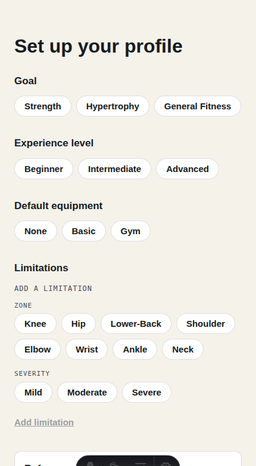
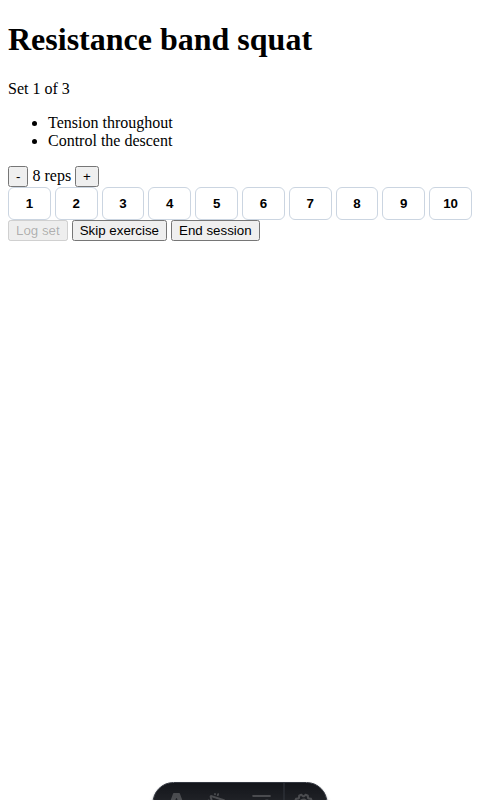
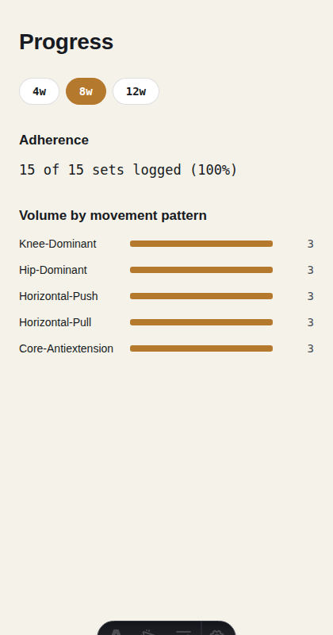

# Personal-TrAIner

[](https://github.com/VictorMerino/personal-trainer/actions/workflows/ci.yml)

Most fitness apps hand you a rigid plan and expect you to adapt to it. This
one inverts that: **the plan adapts to you, every single day** — energy,
pain, and available time all feed into what you get asked to do today, with
an AI-generated (Groq → OpenRouter → deterministic fallback) workout behind
a set of domain rules it cannot override, not a chat window that might.

**The two-level guardrail:** at the product level, an LLM is constrained so
it can't prescribe unsafe training (the pain/readiness policy is domain
logic, not a prompt). At the process level, a coding agent was constrained
so it couldn't write unreviewed code (branch-per-PR, human review on every
merge, CI gates on lint/types/tests/boundaries/build). Same problem —
trusting a non-deterministic system without letting it wreck things —
solved twice, at two different layers. See `docs/ai-workflow.md` for how
that worked in practice, including what went wrong.

## Try it live

**[personal-trainer-indol.vercel.app](https://personal-trainer-indol.vercel.app/)**

Public signup is disabled (see Quickstart below), but there's an open demo
account:

- Email: `demo@personal-trainer.app`
- Password: `demo-trainer-2026`

It's intentionally constrained, not a full account — you'll see a banner
about this in the app itself:

- Workout generation never reaches Groq/OpenRouter, it's always the
  deterministic fallback — no AI cost on a publicly-shared credential.
- Capped at 3 generations/day; past that it returns an error instead of
  silently degrading further.
- Data may be reset at any time.

## Screenshots

| Onboarding | Check-in | Gym logger | Progress |
| --- | --- | --- | --- |
|  |  |  |  |

## Quickstart

Needs [pnpm](https://pnpm.io), [Docker](https://www.docker.com) (for local
Supabase), and the [Supabase CLI](https://supabase.com/docs/guides/local-development/cli/getting-started)
(`npx supabase`, no separate install needed).

```sh
pnpm install
npx supabase start        # local Postgres + Auth + PostgREST, migrations auto-applied
cp .env.example .env      # fill in the SUPABASE_* values `supabase start` just printed
pnpm dev                  # http://localhost:4321
```

Public signup is disabled by design (this is a solo/demo project, not a
public product) — create an account via the Supabase Studio UI
(`http://127.0.0.1:54323` for local, or your Supabase project's dashboard)
or `supabase.auth.admin.createUser` in a one-off script, then log in.

`pnpm db:seed -- --email=<your-account> [--reset]` backfills ~24 days of
realistic history (varied RPE, an adherence gap, a scripted severe-pain
day) by running the real domain logic day-by-day, useful for a populated
progress view.

## Commands

| Command | Action |
| --- | --- |
| `pnpm dev` | Start the dev server at `localhost:4321` |
| `pnpm build` | Production build to `./dist/` |
| `pnpm test` | Unit/component tests (Vitest) |
| `pnpm test:coverage` | Same, with coverage thresholds enforced |
| `pnpm test:rls` | RLS cross-user isolation tests — needs `supabase start` first |
| `pnpm test:e2e` | Playwright E2E specs — needs `supabase start` first |
| `pnpm lint` | ESLint |
| `pnpm typecheck` | `astro check` + `tsc --noEmit` |
| `pnpm depcruise` | Architecture boundary checks (dependency-cruiser) |
| `pnpm depcruise:graph` | Regenerate `docs/dependency-graph.svg` (needs Graphviz's `dot`) |
| `pnpm db:seed` | Backfill realistic demo history for an account |

## Architecture

- `src/features/workout-generation/domain/` — pure business logic (readiness
  policy, deterministic generator, progression/autoregulation, exercise
  catalog). 100% test coverage enforced, zero I/O, zero framework imports.
- `src/features/workout-generation/infrastructure/` — Supabase repositories,
  the Groq/OpenRouter planner adapters behind a fallback chain, prompt
  construction.
- `src/features/workout-generation/ui/` — Svelte components (one per
  screen/flow), calling the backend only through `ui/api-client.ts`'s
  typed functions, never raw `fetch`.
- `src/pages/api/` — Astro API routes, thin: auth, validation, wiring
  domain + infrastructure together.
- `eslint-plugin-boundaries` + `dependency-cruiser` enforce the layer
  direction (`domain` imports nothing from this project; `ui`/`pages` can
  import `domain`/`infrastructure`/`shared`, never the reverse).

`pnpm depcruise:graph` regenerates the dependency graph SVG from the
current import graph — run it locally (needs Graphviz) after structural
changes.

## Documentation

- `docs/PROJECT-BRIEF.md` — the source of truth for what's being built and why.
- `docs/adr/` — architecture decision records, one per significant design choice.
- `docs/features/*.md` — BDD specs, written before each feature's implementation.
- `docs/ai-workflow.md` — how the coding agent was used to build this, and
  what actually went wrong along the way.
- `AGENTS.md` — operating rules for the coding agent, including an
  anti-patterns section grown from real corrections during the build.
